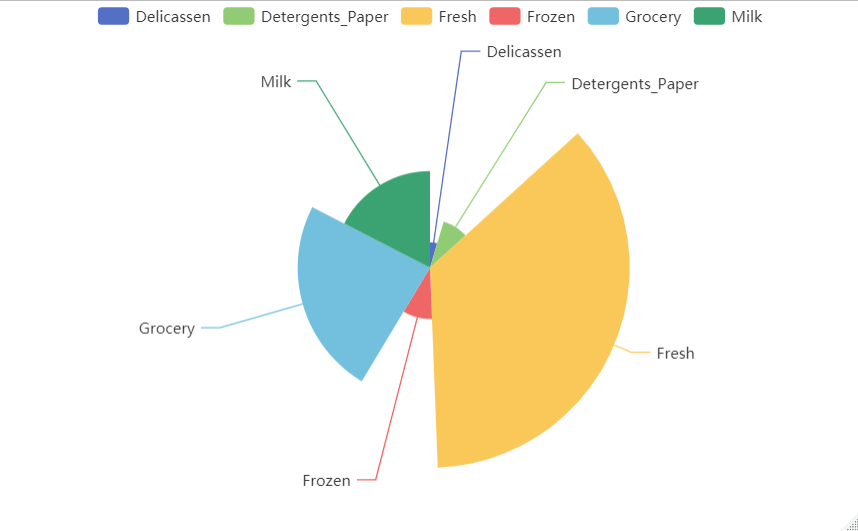
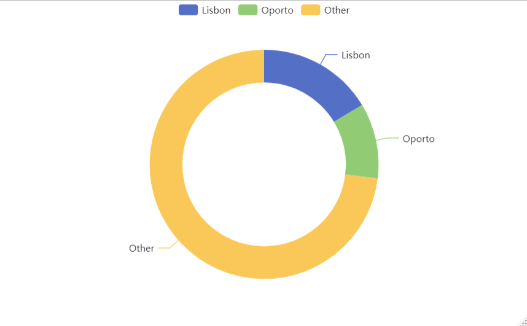

A basic Shiny Dashboard
========================================================
author: Mohamed Lemine Beydia
date: 12/12/2021
autosize: true

First Slide
========================================================
This is the reproducible pitch presentation for the final course project of **Coursera Data Science Specialization Course 9**: **Developing Data Science Tools**. This document will go over the basics of developing a basic Shiny Dashboard app. For more information, please see the following links:

1. The **customers dataset** can be accessed with the command **data(customers)** in R.
Note that this dataset was modified (randomly) to include some useful features.
3. The GitHub repository containing the R codes required to build the Shiny App (**server.R** and **ui.R**)can be accessed [here](https://github.com/wamber-aww/data-products)
2. The Shiny app can be accessed [here](https://wamber.shinyapps.io/swissdata/), which contains
  - A dashboard page summarizing some information on customers, sales and products  
  - Other pages with Histogram,boxplot and a downloadable raw dataset


Data set exploration (1/2)
========================================================


```r
library(datasetsICR)
library(randomNames)
library(kableExtra)
library(dplyr)

data(customers)
customers$CustomerID<-1:nrow(customers)
customers<-cbind(customers,randomNames(nrow(customers), return.complete.data=TRUE))
customers$gender<-ifelse(customers$gender==1,"Female","Man")
customers$Channel<-ifelse(customers$Channel==1,"Hotel/Restaurant/Cafe","Retail")
customers$Region<-ifelse(customers$Region==1,"Lisbon",
                         ifelse(customers$Region==2,"Oporto","Other"))
customers$Age<-round(rnorm(nrow(customers), mean = 50, sd = 10),digits=0)
customers$Total_spend<- as.numeric(apply(customers[,3:8], 1, sum))

customers<-customers[c(9,12,13,14,10,11,1:8,15)]

customers[1:7] %>% slice(1:4) %>%
  kbl(caption = "Subset with the first 7 variables") %>%
  kable_classic(full_width = F, html_font = "Cambria")
```

<table class=" lightable-classic" style="font-family: Cambria; width: auto !important; margin-left: auto; margin-right: auto;">
<caption>Subset with the first 7 variables</caption>
 <thead>
  <tr>
   <th style="text-align:right;"> CustomerID </th>
   <th style="text-align:left;"> first_name </th>
   <th style="text-align:left;"> last_name </th>
   <th style="text-align:right;"> Age </th>
   <th style="text-align:left;"> gender </th>
   <th style="text-align:right;"> ethnicity </th>
   <th style="text-align:left;"> Channel </th>
  </tr>
 </thead>
<tbody>
  <tr>
   <td style="text-align:right;"> 1 </td>
   <td style="text-align:left;"> Maria </td>
   <td style="text-align:left;"> Berumen-Delacruz </td>
   <td style="text-align:right;"> 59 </td>
   <td style="text-align:left;"> Female </td>
   <td style="text-align:right;"> 4 </td>
   <td style="text-align:left;"> Retail </td>
  </tr>
  <tr>
   <td style="text-align:right;"> 2 </td>
   <td style="text-align:left;"> Nicole </td>
   <td style="text-align:left;"> Yoshida </td>
   <td style="text-align:right;"> 41 </td>
   <td style="text-align:left;"> Female </td>
   <td style="text-align:right;"> 2 </td>
   <td style="text-align:left;"> Retail </td>
  </tr>
  <tr>
   <td style="text-align:right;"> 3 </td>
   <td style="text-align:left;"> Victor </td>
   <td style="text-align:left;"> Garcia </td>
   <td style="text-align:right;"> 38 </td>
   <td style="text-align:left;"> Man </td>
   <td style="text-align:right;"> 4 </td>
   <td style="text-align:left;"> Retail </td>
  </tr>
  <tr>
   <td style="text-align:right;"> 4 </td>
   <td style="text-align:left;"> Isaiah </td>
   <td style="text-align:left;"> Johnson </td>
   <td style="text-align:right;"> 53 </td>
   <td style="text-align:left;"> Man </td>
   <td style="text-align:right;"> 3 </td>
   <td style="text-align:left;"> Hotel/Restaurant/Cafe </td>
  </tr>
</tbody>
</table>

```r
customers[7:15] %>% slice(1:4) %>%
  kbl(caption = "Subset with the last 8 variables") %>%
  kable_classic(full_width = F, html_font = "Cambria")
```

<table class=" lightable-classic" style="font-family: Cambria; width: auto !important; margin-left: auto; margin-right: auto;">
<caption>Subset with the last 8 variables</caption>
 <thead>
  <tr>
   <th style="text-align:left;"> Channel </th>
   <th style="text-align:left;"> Region </th>
   <th style="text-align:right;"> Fresh </th>
   <th style="text-align:right;"> Milk </th>
   <th style="text-align:right;"> Grocery </th>
   <th style="text-align:right;"> Frozen </th>
   <th style="text-align:right;"> Detergents_Paper </th>
   <th style="text-align:right;"> Delicassen </th>
   <th style="text-align:right;"> Total_spend </th>
  </tr>
 </thead>
<tbody>
  <tr>
   <td style="text-align:left;"> Retail </td>
   <td style="text-align:left;"> Other </td>
   <td style="text-align:right;"> 12669 </td>
   <td style="text-align:right;"> 9656 </td>
   <td style="text-align:right;"> 7561 </td>
   <td style="text-align:right;"> 214 </td>
   <td style="text-align:right;"> 2674 </td>
   <td style="text-align:right;"> 1338 </td>
   <td style="text-align:right;"> 34112 </td>
  </tr>
  <tr>
   <td style="text-align:left;"> Retail </td>
   <td style="text-align:left;"> Other </td>
   <td style="text-align:right;"> 7057 </td>
   <td style="text-align:right;"> 9810 </td>
   <td style="text-align:right;"> 9568 </td>
   <td style="text-align:right;"> 1762 </td>
   <td style="text-align:right;"> 3293 </td>
   <td style="text-align:right;"> 1776 </td>
   <td style="text-align:right;"> 33266 </td>
  </tr>
  <tr>
   <td style="text-align:left;"> Retail </td>
   <td style="text-align:left;"> Other </td>
   <td style="text-align:right;"> 6353 </td>
   <td style="text-align:right;"> 8808 </td>
   <td style="text-align:right;"> 7684 </td>
   <td style="text-align:right;"> 2405 </td>
   <td style="text-align:right;"> 3516 </td>
   <td style="text-align:right;"> 7844 </td>
   <td style="text-align:right;"> 36610 </td>
  </tr>
  <tr>
   <td style="text-align:left;"> Hotel/Restaurant/Cafe </td>
   <td style="text-align:left;"> Other </td>
   <td style="text-align:right;"> 13265 </td>
   <td style="text-align:right;"> 1196 </td>
   <td style="text-align:right;"> 4221 </td>
   <td style="text-align:right;"> 6404 </td>
   <td style="text-align:right;"> 507 </td>
   <td style="text-align:right;"> 1788 </td>
   <td style="text-align:right;"> 27381 </td>
  </tr>
</tbody>
</table>

Data set exploration (2/2)
========================================================

<table class=" lightable-classic" style="font-family: Cambria; width: auto !important; margin-left: auto; margin-right: auto;">
<caption>Subset with the first 7 variables</caption>
 <thead>
  <tr>
   <th style="text-align:right;"> CustomerID </th>
   <th style="text-align:left;"> first_name </th>
   <th style="text-align:left;"> last_name </th>
   <th style="text-align:right;"> Age </th>
   <th style="text-align:left;"> gender </th>
   <th style="text-align:right;"> ethnicity </th>
   <th style="text-align:left;"> Channel </th>
  </tr>
 </thead>
<tbody>
  <tr>
   <td style="text-align:right;"> 1 </td>
   <td style="text-align:left;"> Anthony </td>
   <td style="text-align:left;"> Cross </td>
   <td style="text-align:right;"> 55 </td>
   <td style="text-align:left;"> Man </td>
   <td style="text-align:right;"> 3 </td>
   <td style="text-align:left;"> Retail </td>
  </tr>
  <tr>
   <td style="text-align:right;"> 2 </td>
   <td style="text-align:left;"> Joe </td>
   <td style="text-align:left;"> Martell </td>
   <td style="text-align:right;"> 38 </td>
   <td style="text-align:left;"> Man </td>
   <td style="text-align:right;"> 4 </td>
   <td style="text-align:left;"> Retail </td>
  </tr>
  <tr>
   <td style="text-align:right;"> 3 </td>
   <td style="text-align:left;"> Imraan </td>
   <td style="text-align:left;"> el-Kalil </td>
   <td style="text-align:right;"> 43 </td>
   <td style="text-align:left;"> Man </td>
   <td style="text-align:right;"> 6 </td>
   <td style="text-align:left;"> Retail </td>
  </tr>
  <tr>
   <td style="text-align:right;"> 4 </td>
   <td style="text-align:left;"> Ashley </td>
   <td style="text-align:left;"> Alvarez-Martinon </td>
   <td style="text-align:right;"> 45 </td>
   <td style="text-align:left;"> Female </td>
   <td style="text-align:right;"> 4 </td>
   <td style="text-align:left;"> Hotel/Restaurant/Cafe </td>
  </tr>
</tbody>
</table>

<table class=" lightable-classic" style="font-family: Cambria; width: auto !important; margin-left: auto; margin-right: auto;">
<caption>Subset with the last 8 variables</caption>
 <thead>
  <tr>
   <th style="text-align:left;"> Channel </th>
   <th style="text-align:left;"> Region </th>
   <th style="text-align:right;"> Fresh </th>
   <th style="text-align:right;"> Milk </th>
   <th style="text-align:right;"> Grocery </th>
   <th style="text-align:right;"> Frozen </th>
   <th style="text-align:right;"> Detergents_Paper </th>
   <th style="text-align:right;"> Delicassen </th>
   <th style="text-align:right;"> Total_spend </th>
  </tr>
 </thead>
<tbody>
  <tr>
   <td style="text-align:left;"> Retail </td>
   <td style="text-align:left;"> Other </td>
   <td style="text-align:right;"> 12669 </td>
   <td style="text-align:right;"> 9656 </td>
   <td style="text-align:right;"> 7561 </td>
   <td style="text-align:right;"> 214 </td>
   <td style="text-align:right;"> 2674 </td>
   <td style="text-align:right;"> 1338 </td>
   <td style="text-align:right;"> 34112 </td>
  </tr>
  <tr>
   <td style="text-align:left;"> Retail </td>
   <td style="text-align:left;"> Other </td>
   <td style="text-align:right;"> 7057 </td>
   <td style="text-align:right;"> 9810 </td>
   <td style="text-align:right;"> 9568 </td>
   <td style="text-align:right;"> 1762 </td>
   <td style="text-align:right;"> 3293 </td>
   <td style="text-align:right;"> 1776 </td>
   <td style="text-align:right;"> 33266 </td>
  </tr>
  <tr>
   <td style="text-align:left;"> Retail </td>
   <td style="text-align:left;"> Other </td>
   <td style="text-align:right;"> 6353 </td>
   <td style="text-align:right;"> 8808 </td>
   <td style="text-align:right;"> 7684 </td>
   <td style="text-align:right;"> 2405 </td>
   <td style="text-align:right;"> 3516 </td>
   <td style="text-align:right;"> 7844 </td>
   <td style="text-align:right;"> 36610 </td>
  </tr>
  <tr>
   <td style="text-align:left;"> Hotel/Restaurant/Cafe </td>
   <td style="text-align:left;"> Other </td>
   <td style="text-align:right;"> 13265 </td>
   <td style="text-align:right;"> 1196 </td>
   <td style="text-align:right;"> 4221 </td>
   <td style="text-align:right;"> 6404 </td>
   <td style="text-align:right;"> 507 </td>
   <td style="text-align:right;"> 1788 </td>
   <td style="text-align:right;"> 27381 </td>
  </tr>
</tbody>
</table>

Some Basic charts included in the app
========================================================



